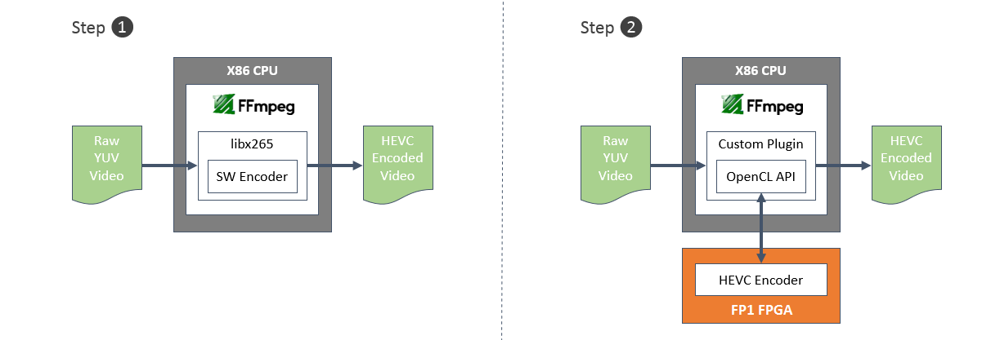

  <tr>
    <th width="100%" colspan="5"><h2>XDF 2018 - NGCodec Demo</h2></th>
  </tr>

---------------------------------------

### Experiencing FP1c Acceleration

In this module you will experience the acceleration potential of Huawei cloud FP1c instances by using ```ffmpeg``` to encode video stream files, and compare the performance with the libx265 codec running on CPU.



```ffmpeg``` is a very popular framework providing very fast video and audio converters. The ```ffmpeg``` code is open-source and allows for the addition of custom plugins. For this workshop, a custom plugin has been created to transparently use the NGCodec HEVC encoder running on Huawei FP1c.  

Users can switch between the libx265 software codec and the FP1c-accelerated implementation by simply changing a parameter on the ```ffmpeg``` command line. The plugin uses OpenCL API calls to write video frames to the FPGA, execute the encoder and read back the compressed video.

The HEVC encoder is provided courtesy of **NGCodec** [(www.ngcodec.com)](www.ngcodec.com).

#### Setting-up the workshop

1. Open a new terminal by right-clicking anywhere in the Desktop area and selecting **Open Terminal**.
1. Navigate to the NGCodec_demo directory.
    ```bash
    cd /XDF/NGCodec_demo/FFmpeg/build
    ```

1. Source the SDAccel runtime environment.
    ```bash
    source /XDF/huaweicloud-fpga/fp1/setup.sh
    ```

#### Step 1: Running with the encoder on the CPU

1. Encode using the libx265 software codec running on the CPU. You may use pre-built script or input below command directly.

###### Method 1
```bash
sh hevc_tst_cpu.cmd
```
###### Method 2
```bash
ffmpeg -f rawvideo -s:v 1920x1080 -pix_fmt yuv420p -i  ../../input/crowd8_420_1920x1080_50.yuv -c:v libx265 -an -frames 1000 -preset medium -g 30 -q 40 -f hevc -y ./hw_outdir/crowd8_cpu_tst.hevc
```
The encoder will finish with a message similar to this one: \
*frame=500 **fps=13.0** q=-0.0 **Lsize=19361kB** time=00:00:19.92 bitrate=7962.3kbits/s  
> **fps** measures the performance of the encoder in processed frames per second. \
**size** measures the size of the compressed output file. \


#### Step 2: Running with the encoder on the FP1c FPGA

1. Set up environment
```bash
XILINX_SDX_PATH=${XILINX_SDX}
export LD_LIBRARY_PATH=${XILINX_SDX_PATH}/runtime/lib/x86_64:${XILINX_SDX_PATH}/lib/lnx64.o/Default:${XILINX_SDX_PATH}/lib/lnx64.o:$(pwd)/../../xmaapi/lib
export XILINX_OPENCL=$(pwd)/../../../userspace/sdaccel/lib
```

2. Encode using the NGCodec HEVC encoder running on the FP1c FPGA. You may use pre-built script or input below command directly.

###### Method 1
  ```bash
  sh hevc_tst.cmd
  ```

###### Method 2
  ```bash
  ./ffmpeg -f rawvideo -s:v 1920x1080 -pix_fmt yuv420p -i  ../../input/crowd8_420_1920x1080_50.yuv -c:v NGC265 -an -frames 1000 -psnr -g 30 -global_quality 40 -f hevc -y ./hw_outdir/crowd8_tst.hevc
  ```
The encoder will finish with a message similar to this one: \
*frame=500 **fps=50** q=-0.0 **Lsize=19814kB** time=00:00:20.04 bitrate=8099.5kbits/s **speed=2.02x***
> **speed** measures the ratio of video time to encoding time.


#### Step 3: Comparing performance

1. The table below summarizes the performance of both encoders:

    |                           | HEVC encoding on CPU | HEVC encoding on FP1c  |
    | :------------------------ |-------------:| -------:|
    | performance               | 13 fps        | 50 fps  |
    | speed vs real-time        | 0.64 x *      | 2.02 x  |
    | compressed file size      | 19.3 MB      | 19.8 MB |
    | FPGA acceleration ratio   |               | 3.1 x|     

*Note: FFmpeg doesn't print speed value directly. It can be calculated as 16fps/25fps=0.64.

#### step 4(optional): Viewing output video files

1. Open a VNC viewer and connect to your instance.
2. Navigate to NGCodec demo folder.
    ```bash
    cd /XDF/NGCodec_demo/FFmpeg/build
    ```
3. Play the output encoded video files.
    ```bash
    ffplay ./hw_outdir/crowd8_tst.hevc
    ```

Note: Using VNC viewer to watch the video is limited to network bandwidth so that the video streaming may not be fluent.

#### step 5: Close your terminal to conclude this module.
   ```bash
   exit
   ```

#### Conclusion

Huawei FP1c instances with Xilinx FPGAs can provide significant performance improvements over CPUs.The HEVC encoder running on F1 is 3.1x faster than the libx265 codec running on the CPU. It also provides better compression without sacrificing quality.

Multiple instances of the NGCodec encoder could be loaded in the FPGA, allowing parallel processing of multiple video streams and easily delivering more than a 10x increase in performance/$ over a CPU-based solution.

It is possible to use FP1c to accelerate popular frameworks such as ```ffmpeg```. This is a very powerful proposition as it allows end-users to keep working with their preferred tools and APIs while transparently benefiting from acceleration.

In addition to video transcoding, FP1c instances are very well suited to accelerate compute intensive workloads such as: genomics, financial analytics, big data analytics, security or machine learning.

Now that you have experienced the performance potential of Huawei FP1c instances, the next lab will introduce you to the SDAccel IDE and how to develop, profile and optimize an FP1c application.

--------------------------------------

## Appendix

#### If you think the demo was broken, you may use below methods to recover the demo.

1. Change directory to the XDF folder
   ```bash
   cd /XDF/
   ```

2. Remove the current NGCodec_demo folder
   ```bash
   rm -rf NGCodec_demo
   ```

3. Unzip the tar file
   ```bash
   tar -zxf ngcodec.tar.gz
   ```

4. Check xclbin file availability
   ```bash
   ls /XDF/huaweicloud-fpga/fp1/hardware/sdaccel_design/examples/ngcodec/prj/bin
   ```

   Check if vu9p_abrScal_ngcHevc.xclbin is there. If not, copy the file from /XDF/NGCodec_demo/xclbins/ to this path.

5. Check yaml file availability
   ```bash
   ls /tmp | grep ffmpeg
   ```

   Check if ffmpeg_cfg.yaml is there. If no, copy the file from /XDF/NGCodec_demo/ to this path. Then modify the ffmpeg_cfg.yaml as below:

   - pluginpath: /XDF/NGCodec_demo/xmaapi/share/libxmaapi
   - xclbinpath: /XDF/huaweicloud-fpga/fp1/hardware/sdaccel_design/examples/ngcodec/prj/bin
